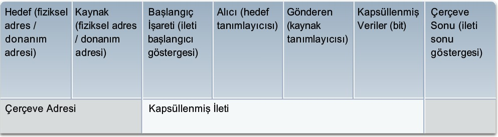
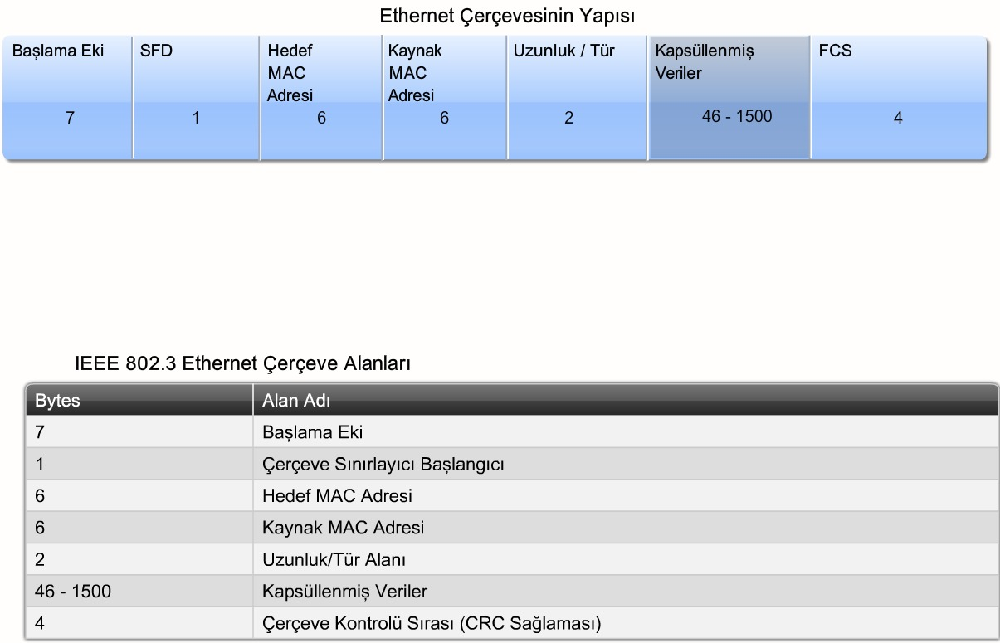
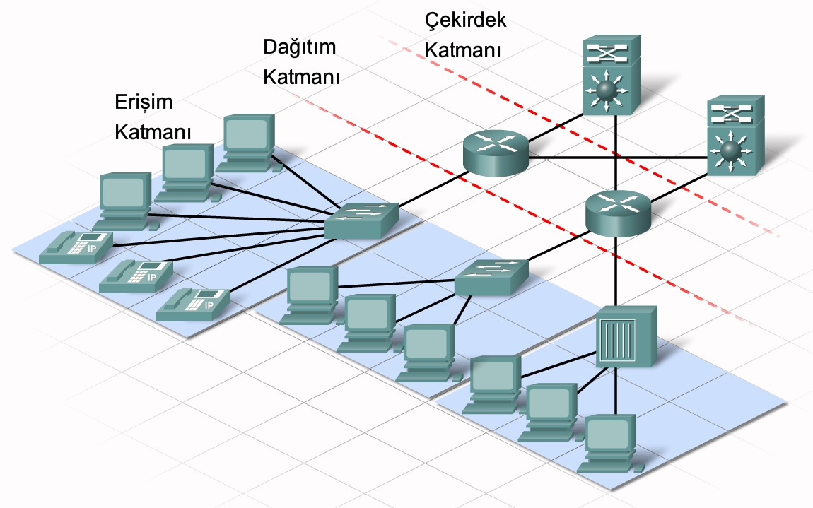
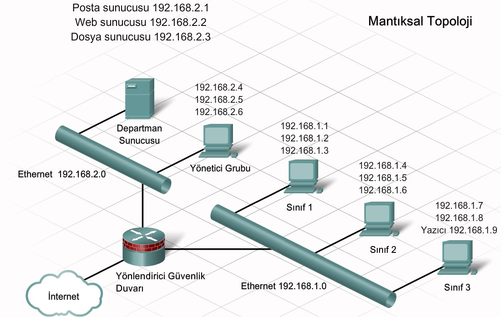
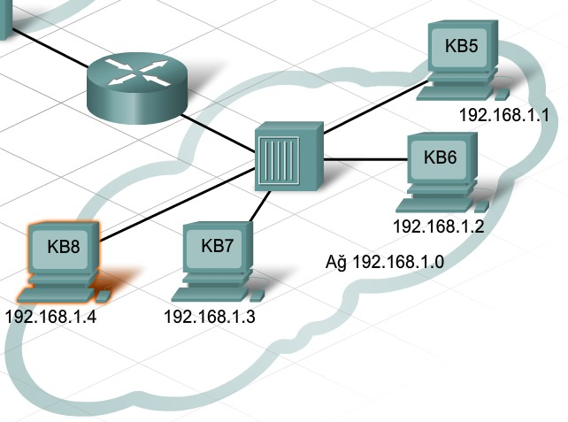
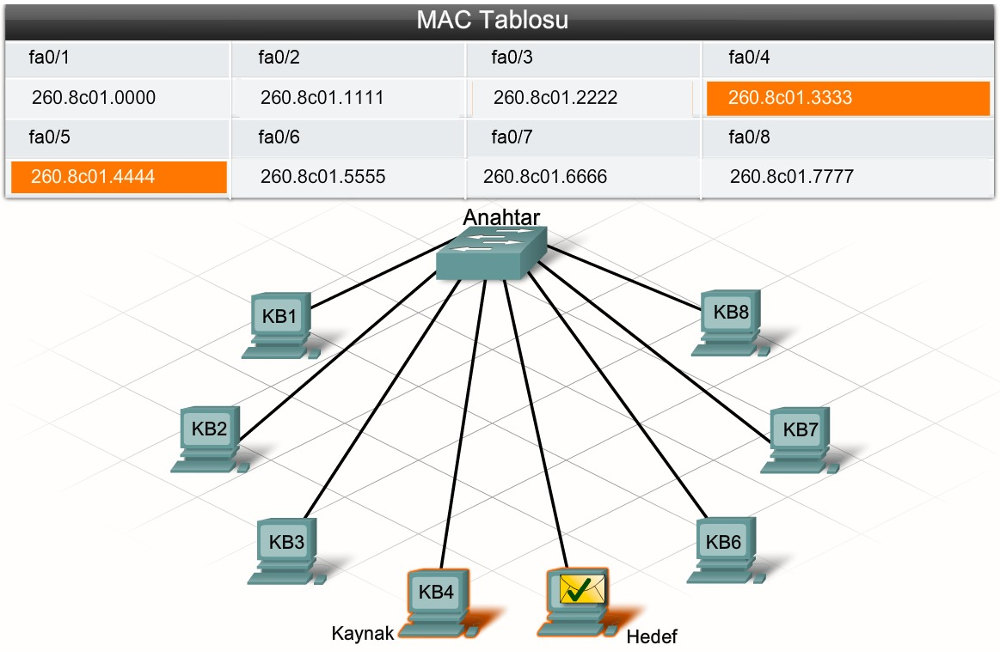
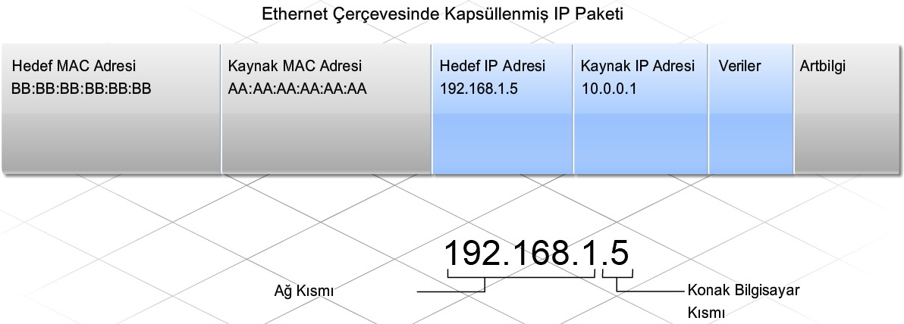
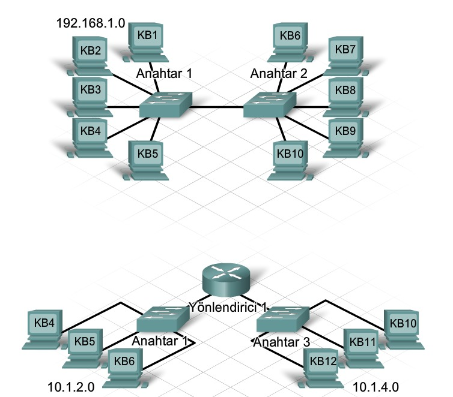

# 3. Ağa Bağlanma

#### 3.1.5 Eşler Arası Ağlar

İstemci ve sunucu yazılımı genellikle ayrı bilgisayarlarda çalışır ancak bir bilgisayarın aynı anda iki rolü gerçekleştirmesi de mümkündür. Küçük işletmelerde ve evlerde birkaç bilgisayar ağ üzerinde sunucu ve istemci işlevlerine sahiptir. Bu ağ tipine **eşler arası** ağ denir.

En basit eşler arası ağ, **kablolu veya kablosuz bağlantı kullanılarak doğrudan bağlanmış iki bilgisayar**dan oluşur.

**Avantajları**

- Kurulumu kolaydır.
- Maliyeti düşüktür (ağ cihazlarına ihtiyaç duyulmayabileceğinden).
- Basit görevler(dosya aktarımı ve yazıcı paylaşımı) için kullanılabilir.

**Dezavantajları**

- Konak bilgisayar aynı anda hem istemci hem de sunucu olarak hareket ettiğinde başarımının düşebilmesidir.
- Merkezi yönetimi yoktur.
- Ölçeklenebilir değildir.
- Minimum güvenlik sağlar.

#### 3.2.4 İleti Biçimlendirme

Her bilgisayar iletisi, ağ üzerinden gönderilmeden önce **çerçeve** adı verilen belirli bir biçime kapsüllenir.

#### 3.2.6 İleti Zamanlama

**Erişim Yöntemi**: Kişinin ileti gönderebileceği zamanı belirler. Ağdaki konak bilgisayarların, ileti göndermeye başlayacakları zamanı ve hata oluşunca nasıl yanıt vereceklerini bilmesi için bir erişim yöntemine ihtiyaçları vardır.

**Akış Denetimi**: Zamanlama, gönderilebilecek bilgi miktarını ve bilginin teslim edilme hızını da etkiler. Ağ iletiminde, gönderen konak bilgisayar iletileri hedef konak bilgisayarın alıp işleyebileceği düzeyden daha yüksek hızda iletilebilir. 

**Yanıt Zaman Aşımı**: Birisi bir soru sorup kabul edilebilir bir süre içinde bir yanıt alamazsa, söz konusu kişi yanıt gelmediğini varsayarak ona göre hareket eder. Ağdaki konak bilgisayarların da yanıt bekleme sürelerini ve yanıtın zaman aşımına uğraması durumunda uygulanacak eylemi belirten kuralları vardır.

#### 3.3.2 Protokollerin Standartlaştırılması

IEEE (Institute of Electrical and Electronics Engineers) 802.3 komitesi Ethernet standartlarından sorumludur.

802.3 100BASE-T

​	100, Mbps cinsinden hızıdır.

​	BASE, temel bant iletimini ifade eder.

​	T, kablo tipini ifade eder, bu örnekteki kablo tipi bükümlü çifttir.

#### 3.3.3 Fiziksel Adresleme

Konak bilgisayarın ağda tanımlanmasını sağlamak için Ethernet ağına bağlı her konak bilgisayar bir fiziksel adres (Media Access Control - MAC) atanır.

Ethernet ağında, konak bilgisayar MAC adresi, kişinin adına benzer.

Fiziksel adres, konak bilgisayarın ağda bulunduğu yer dikkate alınmaksızın aynı kalır.

#### 3.3.5 Ethernet Ağlarının Hiyerarşik Tasarımı

Ağ iletişiminde, cihazları katmanlı bir yaklaşımla düzenlenmiş birden çok ağ şeklinde gruplandırmak için hiyerarşik tasarım kullanılır.

**Erişim Katmanı:** Yerel bir Ethernet ağında konak bilgisayarlarla bağlantı sağlar. İleti, yerel bir konak bilgisayara hedeflenirse, IP adresinin ağ bölümü temel alınarak ileti yerel kalır. Farklı bir ağa hedeflenirse, ileti dağıtım katmanına geçer.

**Dağıtım Katmanı:** Daha küçük yerel ağların birbirine bağlanmasını sağlar ve ağlar arasındaki bilgi akışını denetler.

**Çekirdek Katmanı:** Dağıtım katmanı cihazları arasında yüksek hızlı bağlantı sağlar. Ana hedefi, verileri hızla taşımaktır.

#### 3.3.6 Mantıksal Adresleme

Ip adresi kişilerin adresine benzer. Bu adres, konak bilgisayarın bulunduğu yer temel alınarak mantıksal olarak atandığından, mantıksal adres olarak bilinir.

Ip adresleri ağ ve konak olmak üzere iki bölümden oluşur. Ağ bölümü, aynı yerel ağa bağlı tüm konak bilgisayarlarla aynıdır. Aynı yerel ağ içinde, IP adresinin konak bilgisayar bölümü her bir konak bilgisayar için benzersizdir.

#### 3.4.2 Dağıtıcıların İşlevi

Dağıtıcı, ethernet ağının **Erişim Katmanına** takılan bir tip ağ iletişim cihazıdır. Dağıtıcı yalnızca bir bağlantı noktasından gelen elektronik sinyalleri kabul eder ve diğer tüm bağlantı noktalarından aynı iletiyi yeniden oluşturur.

Ethernet dağıtıcısındaki bağlantı noktalarının tümü, ileti gönderip almak için aynı kanala bağlanır. Tüm konak bilgisayarların o kanaldaki kullanılabilir bant genişliğini paylaşması gerektiğinden, dağıtıcıya paylaşılan bant genişli cihazı da denir.

Bir Ethernet dağıtıcısı üzerinden aynı anda yalnızca bir ileti gönderilebilir. Bir dağıtıcıya bağlı iki veya daha fazla konak bilgisayar aynı anda ileti göndermeyi deneyebilir. Bu durumda, iletiyi oluşturan elektronik sinyaller dağıtıcıda birbiriyle çatışır.

#### 3.4.3 Anahtarların İşlevi

Ethernet anahtarı, **Erişim Katmanında** kullanılan bir cihazdır. **Anahtardaki MAC adresi tablosunda**, tüm etkin bağlantı noktalarının bir listesi ve bunlara bağlı konak bilgisayar MAC adresleri bulunur. Konak bilgisayarlar arasında bir ileti gönderildiğinde, anahtar, hedef MAC adresinin tabloda olup olmadığını kontrol eder. MAC adresi tablodaysa, anahtar, kaynak ve hedef bağlantı noktaları arasında **devre** adı verilen geçici bir bağlantı oluşturur. Konak bilgisayarlar arasındaki her yeni iletişim için yeni bir devre oluşturulur. Bu ayrı devreler, çatışma oluşmadan aynı anda birçok iletişimin gerçekleşmesine izin verir.

​	*Anahtar, henüz MAC adresi tablosunda bulunmayan yeni bir konak bilgisayarın adresine gönderilen bir çerçeve aldığında ne olur?*

Anahtar, hedef konak bilgisayarın bulunduğu yeri belirleyemediğinde, iletiyi tüm bağlı konak bilgisayarlara iletmek için **taşma** adı verilen bir işlemi gerçekleştirir. Konak bilgisayarların her biri iletideki hedef MAC adresini kendi MAC adresiyle karşılaştırır ancak yalnızca doğru hedef adrese sahip olan konak bilgisayar iletiyi işler ve gönderene yanıt verir.

​	*Yeni bir konak bilgisayarın MAC adresi nasıl MAC adresi tablosuna girer?*

Anahtar, **konak bilgisayarlar arasında gönderilen her çerçevenin kaynak MAC adresini inceleyerek** MAC adresi tablosunu oluşturur. Yeni bir konak bilgisayar ileti gönderdiğinde veya taşmış bir iletiye yanıt verdiğinde, anahtar hemen onun MAC adresini ve bağlı olduğu bağlantı noktasını öğrenir. **Anahtar her yeni bir kaynak MAC adresi okuduğunda, tablo dinamik olarak güncellenir.** 

**Her anahtar bağlantı noktası ayrı bir çatışma etki alanı oluşturur.** Aşağıdaki topolojide toplam on çatışma etki alanı vardır. 

- Dağıtıcıya bağlı tüm konak bilgisayarlar, dağıtıcıya bağlı anahtar bağlantı noktası tarafından oluşturulmuş çatışma etki alanının bölümü olarak bulunur. 
- Anahtar 1 ve Anahtar 2 arasındaki bağlantı ikinci bir çatışma etki alanıdır. 
- Anahtar 1 ve Anahtar 2 üzerindeki sekiz konak bilgisayar bağlantısı, kalan sekiz çatışma etki alanını oluşturur.

#### 3.4.4 Yayın İletileri

Yayınlar, bir konak bilgisayarın bilgi bulması gerektiğinde ancak diğer konak bilgisayarlardan hangisinin bilgiyi sağlayacağını bilmediğinde **veya** bir konak bilgisayar aynı ağdaki diğer tüm konak bilgisayarlara gereken zamanda bilgi sağlamak istediğinde kullanışlıdır.

Yayın MAC Adresi: **FFFF . FFFF . FFFF**

#### 3.4.7 Adres Çözümleme Protokolü (ARP - Address Resolution Protocol)

*Gönderen bir konak bilgisayarda yalnızca hedef konak bilgisayarın mantıksal IP adresi varsa ne olur? Gönderen konak bilgisayar, çerçeve içine hangi hedef MAC adresinin yerleştirileceğini nasıl belirler ?*

Gönderen konak bilgisayar, aynı yerel ağdaki herhangi bir konak bilgisayarın MAC adresini keşfetmek için **adres çözümleme protokolü** adı verilen bir IP protokolünü kullanabilir.

1. Gönderen konak bilgisayar bir yayın MAC adresine yönelik bir çerçeve (hedef konak bilgisayarın IP adresinin bulunduğu) oluşturup gönderir.
2. Ağdaki her konak bilgisayar yayın çerçevesini alır ve iletinin içindeki IP adresiyle kendininkini karşılaştırır. Aynı IP adresine sahip olan konak bilgisayar, MAC adresini başlangıçtaki gönderen konak bilgisayara geri gönderir.
3. Gönderen konak bilgisayar iletiyi alır ve MAC adresi ile IP adresi bilgilerini ARP tablosu adı verilen bir tabloda saklar.

#### 3.5.2 Yönlendiricilerin İşlevi

Yönlendirici, yerel ağı başka yerel ağlara bağlayan bir ağ iletişim cihazıdır. Ağın Dağıtım Katmanında yönlendiriciler trafiği yönlendirir ve ağ işleminin verimliliği açısından kritik olan diğer işlevleri gerçekleştirir. Ancak yalnızca MAC adresi bilgilerini içeren çerçevelerin kodunu çözen anahtarlardan farklı olarak, **yönlendiriciler çerçeve içinde kapsüllenmiş paketin kodunu çözer**.

Her yönlendiricide yerel olarak bağlı tüm ağların ve bu ağları bağlayan arayüzlerin bir tablosu bulunur.

Yönlendirici arayüzleri, yayın MAC adresine yönelik iletileri iletmez.

Yönlendiriciler ağ yapılandırmasının karmaşıklığını artırır ve bir yerel ağdan diğerine gönderilen paketlerde gecikmeye yol açabilir.

#### 3.5.3 Varsayılan Ağ Geçidi

Konak bilgisayarın uzak bir ağa ileti göndermesi gerektiğinde yönlendiriciyi kullanması gerekir. Konak bilgisayar **paketin içine hedef konak bilgisayarın IP adresini ekler**. Paketi çerçeveye kapsüllerken, **çerçevenin hedefi olarak yönlendiricinin MAC adresini** kullanır. Böylece yönlendirici çerçeveyi alıp MAC adresini temel alarak kabul eder.

Konak bilgisayara TCP/IP ayarlarında yapılandırılan **varsayılan ağ geçidi adresi** üzerinden yönlendiricinin IP adresi verilir. Yerel ağdaki tüm konak bilgisayarlar iletileri yönlendiriciye göndermek için varsayılan ağ geçidi adresini kullanır. Konak bilgisayar, varsayılan ağ geçidi IP adresini öğrendikten sonra, MAC adresini belirlemek için ARP'yi kullanır.

#### 3.5.6 Yerel ve Uzak Ağlara Konak Bilgisayar Ekleme

Tüm konak bilgisayarların tek bir yerel ağa yerleştirilmesi, bunların diğer tüm konak bilgisayarlar tarafından görülebilmesini sağlar. Bunun nedeni bir yayın etki alanı olması ve konak bilgisayarların birbirini bulmak için ARP kullanmasıdır.

