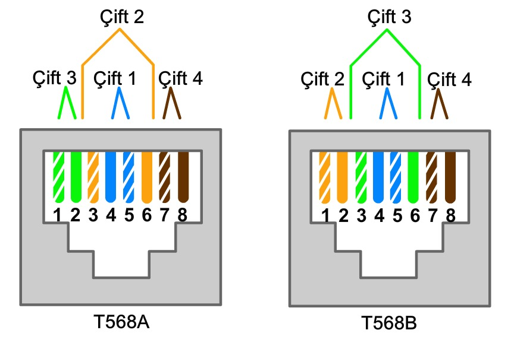

# 4. ISP Üzerinden İnternet'e Bağlanma

IP paketlerine datagram denir.

Internet protokolü; verileri, uzunluğu 500-1500 bayt arasında olan ve geçerli bir kaynak ve hedef IP adresi içermesi gereken paketler halinde biçimlendirir.

#### 4.2.3 Paketlerin İnternet Üzerinden İletilmesi

Ping, kaynak ve hedef arasındaki uçtan uca bağlantıyı sınar.

Traceroute, kaynaktan hedefe giden rotayı izler. Paketlerin üzerinden geçtiği her yönlendiriciye **sekme** denir.

#### 4.4.1 Yaygın Ağ Kabloları

Bükümlü çift (TP) kablo, ağ iletişiminde en sık kullanılan kablo tiplerinden biridir.

Büklümlü çift kabloda, birim uzunluğu başına düşen büklüm sayısı, kablonun girişime karşı sahip olduğu direnç miktarını etkiler.

#### 4.5.2 UTP Kablolar

**Düz Bağlantılar**

Anahtar - Yönlendirici

Dağıtıcı - PC

**Çapraz Bağlantılar**

Anahtar - Anahtar

Dağıtıcı - Dağıtıcı

Anahtar - Dağıtıcı

PC - PC

Yönlendirici - Yönlendirici

PC - Yönlendirici

