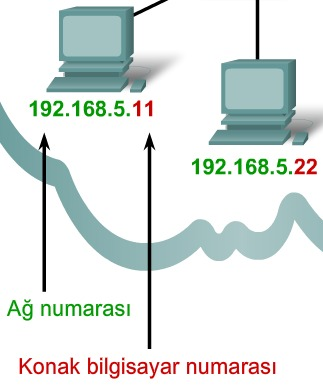
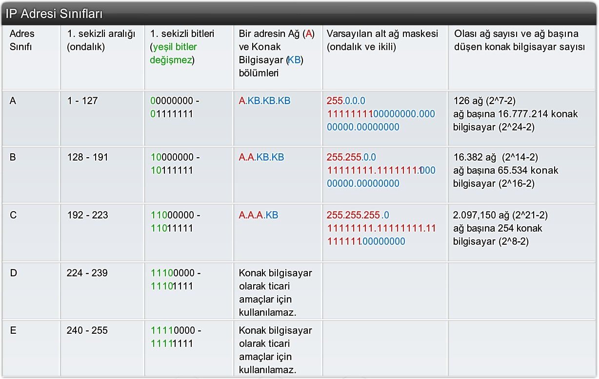
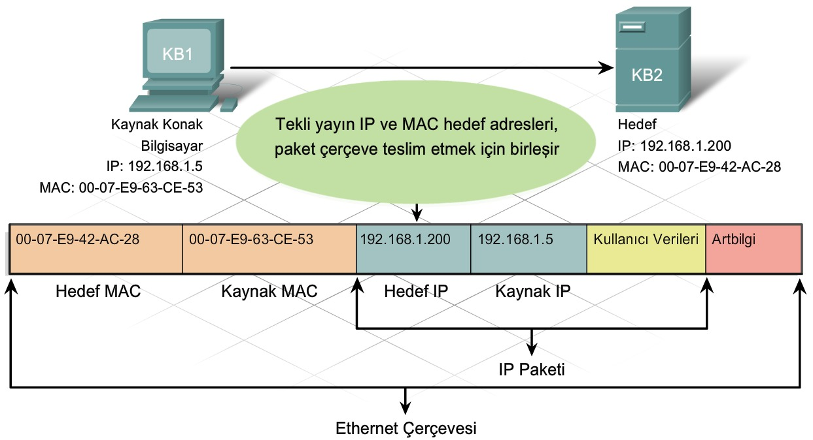
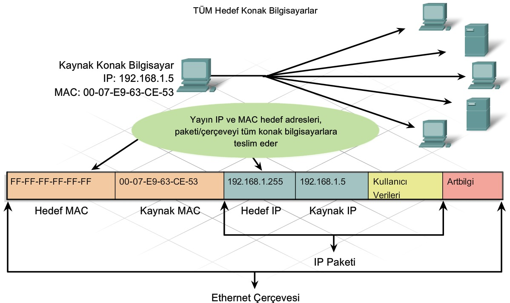
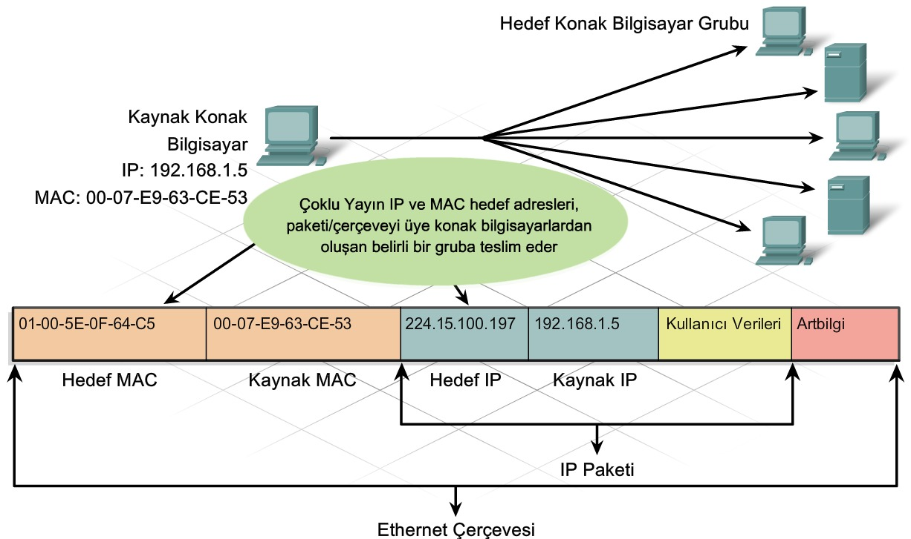
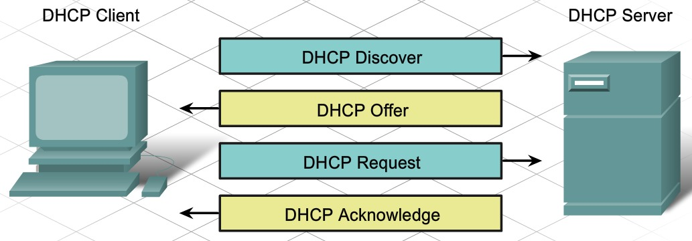
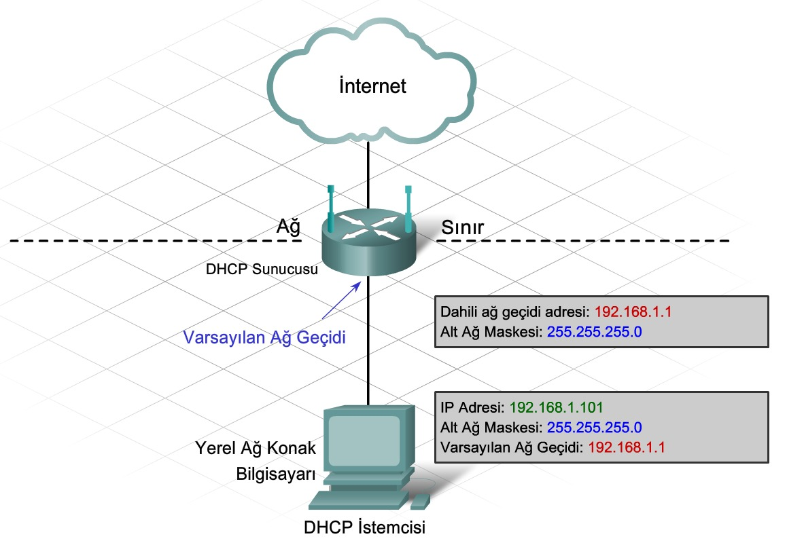
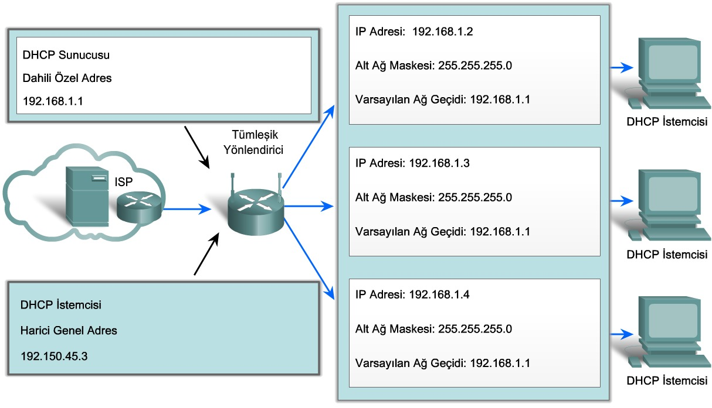
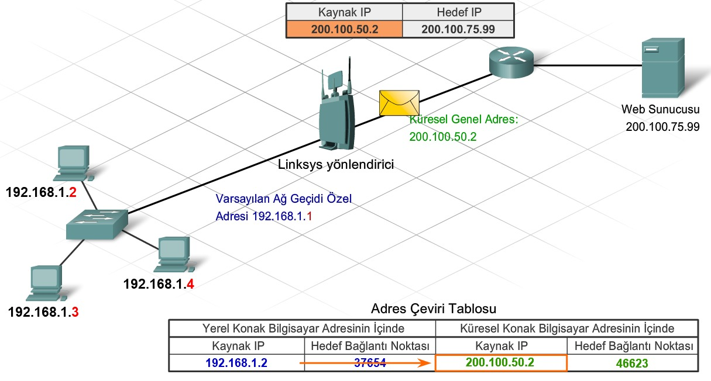

# 5. Ağ Adresleme

#### 5.1.1 IP Adresinin Amacı

Konak bilgisayarların İnternet'e girebilmeleri için IP adresine ihtiyacı vardır. IP adresi, bir konak bilgisayarın Ağ arayüzü bağlantısına atanır. Bu bağlantı genellikle cihaza takılı bir ağ arayüzü kartıdır (Network Interface Card - NIC). İnternet üzerinden gönderilen her paket, bir kaynak ve bir hedef IP adresine sahiptir.

Mantıksal 32 bit IP adresi hiyerarşik olup **ağ** ve **konak** olmak üzere iki bölümden oluşur.

#### 5.1.4 IP Adreslerinin ve Alt Ağ Maskelerinin Etkileşim Kurma Biçimi

Alt ağ maskesi, IP adresinin hangi bölümünün ağ hangi bölümünün konak bilgisayara ait olduğu belirtir.

*IP adresinin konak bilgisayar bölümünde yer alan tüm* **1'lerin** o ağın yayın adresi olduğunu ve belirli bir konak bilgisayara atanamayacağını belirtir.

*IP adresinin konak bilgisayar bölümünde yer alan tüm* **0'lar** ağ kimliğini ve belirli bir konak bilgisayara atanamyacağını belirtir.

127.0.0.0, geri döngü (loopback) adresidir.

#### 5.2.1  IP Adresi Sınıfları ve Varsayılan Alt Ağ Maskeleri

#### 5.2.3 Tek Yayın, Yayın ve Çoklu Yayın Adresleri

**Tekli Yayın**

 

**Yayın**

Yayın etki alanındaki tüm konak bilgisayarlar paketi alıp bakar. ARP ve DHCP gibi ağ protokollerinin çoğu yayınları kullanır.

Bir ağa ilişkin yayın IP adresinin, Ethernet çerçevesinde karşılık gelen bir yayın MAC adresine sahip olması gerekir. Ethernet ağlarında yayın MAC adresi, FF-FF-FF-FF-FF-FF (48 bit) dir.

**Çoklu Yayın**

Çoklu yayın grubuna ait cihazlar, çoklu yayın IP adresi grubuna atanır. Çoklu yayın adres aralığı **224.0.0.0 - 239.255.225.225** 'dir. Çoklu yayın adresleri bir adres grubunu temsil ettiğinden, bunlar yalnızca paketin hedefi olarak kullanılabilir. Kaynakta her zaman bir tek yayın adresi bulunur.

Birçok oyuncunun uzaktan bağlanıp aynı oyunu oynaması ve birçok öğrencinin aynı sınıfa bağlanmasıyla gerçekleşen video konferansı çoklu yayına örnektir.

Çoklu yayın MAC adresi 01-00-5E ile başlayan özel bir değerdir.

#### 5.3.1 Statik ve Dinamik Adres Ataması

DHCP, IP adresi, alt ağ maskesi, varsayılan ağ geçidi ve diğer yapılandırma bilgileri gibi adresleme bilgilerini otomatik atama mekanizması sağlar.

DHCP'nin başka bir avantajı da, adresin bir konak bilgisayara kalıcı olarak atanmayıp yalnızca belirli bir süre kiralanmasıdır. Konak bilgisayarın gücü kesilirse veya ağdan çıkarılırsa, adres yeniden kullanım için havuza geri döner. Bu da özellikle ağa girip çıkan mobil kullanıcılara yardımcı olur.

#### 5.3.3 DHCP'yi Yapılandırma

Bir konak bilgisayar ilk olarak DHCP istemcisi olarak yapılandırıldığında, IP adresine, alt ağ maskesine veya varsayılan ağ geçidine sahip değildir. Bu bilgileri yerel ağda veya ISP'de bulunan DHCP sunucusundan edinir. DHCP sunucusu, DHCP istemcilerine atanabilen IP adresleri aralığı veya havuzuyla yapılandırılır.

IP adresine gereksinim duyan bir istemci, **255.255.255.255** hedef IP adresi ve **FF-FF-FF-FF-FF-FF** hedef MAC adresine sahip bir yayın olan **DHCP keşfi (DHCP Discovery** iletisini gönderir. Ağdaki tüm konak bilgisayarlar bu yayın DHCP çerçevesini alır, ancak yalnızca DHCP sunucusu yanıt verir. Sunucu, istemci için bir IP adresi önererek **DHCP teklifini (DHCP Offer)** yanıtlar. Daha sonra, konak bilgisayar bu sunucuya önerilen IP adresinin kullanılmasını isteyen bir **DHCP isteği (DHCP Request)** gönderir. Sunucu, **DHCP Onayı (DHCP Acknowledge)** ile yanıt verir.

#### 5.4.1 Ağ Sınırları ve Adres Alanı

Yönlendirici, bir ağdaki konak bilgisayarların farklı ağlardaki konak bilgisayarlarla iletişim kurabildiği bir ağ geçidi sağlar. Yönlendiricideki her arayüz ayrı bir ağa bağlanır. Arayüze atanan IP adresi, doğrudan arayüze bağlanan yerel ağı tanımlar.

Ağdaki her konak bilgisayar diğer ağlara geçiş sağlayan ağ geçidi olarak yönlendiriciyi kullanmalıdır. Bu nedenle her konak bilgisayarın bağlı olduğu ağa bağlanan yönlendirici arayüzünün IP adresini bilmesi gerekir. Bu adres **varsayılan ağ geçidi adresi** olarak bilinir.

#### 5.4.2 Adres Ataması

Tümleşik yönlendirici, Ethernet kablosuyla veya kablosuz olarak kendisine bağlı tüm yerel konak bilgisayarlar için DHCP sunucusu olarak hareket eder. Çoğu DHCP sunucusu, dahili ağdaki konak bilgisayarlara İnternet'te yönlendirilebilir genel adresler yerine, özel adresler atayacak biçimde yapılandırılmıştır. Böylece, varsayılan olarak dahili ağa doğrudan İnternet'ten erişilmez.

#### 5.4.3 Ağ Adresi Çeviricisi

Tümleşik yönlendirici, ISP'den genel bir adres alır ve bu adresi tümleşik yönlendiricinin İnternet'te paket gönderip almasını sağlar. Bunun sonucunda da yerel ağ istemcilerine özel adresler sağlar. İnternet'te özel adreslere izin verilmediğinden, yerel istemcilerin İnternet'te iletişim kurmasını sağlamak için, özel adreslerin benzersiz genel adreslere çevrilmesi gerekir.

Özel adresleri İnternet'te yönlendirilebilir adreslere dönüştürme işlemine **Ağ Adresi Çeviricisi (Network Address Translation - NAT)** adı verilir. NAT işlemiyle, özel bir kaynak IP adresi, genel bir adrese çevrilir. Gelen paketler için de işlemin tersi gerçekleşir. Tümleşik yönlendirici, NAT işlemiyle birçok dahili IP adresini aynı genel adrese çevirebilir.

Birden fazla özel IP adresi tek bir genel IP adresine çevrildiği zaman, yönlendirici çevrilen her bir kaynak IP adresini ve bağlantı numarasını izler ve böylece geri dönen trafik doğru konak bilgisayara yönlendirilir.

