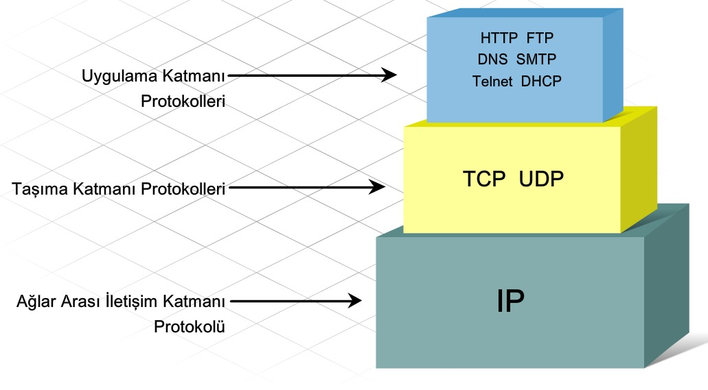
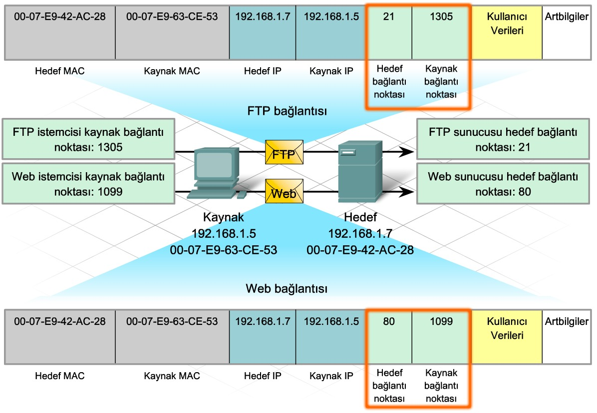
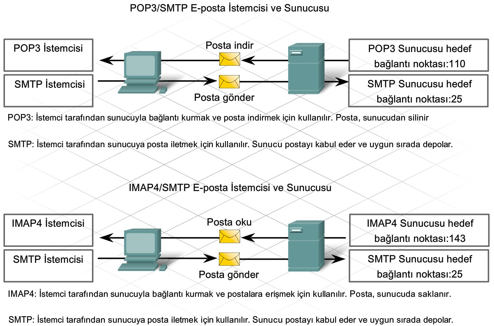
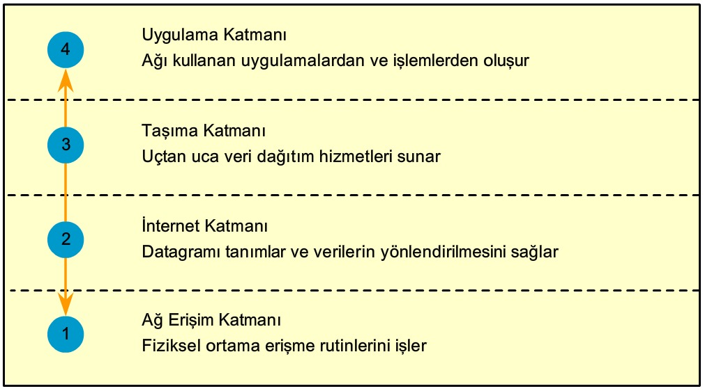
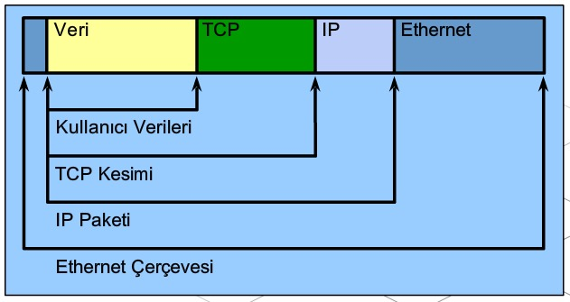
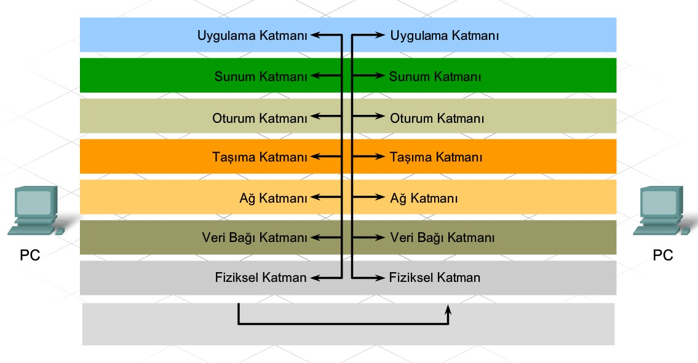
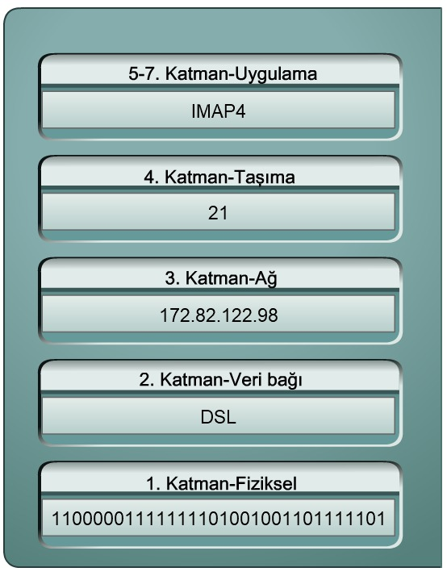
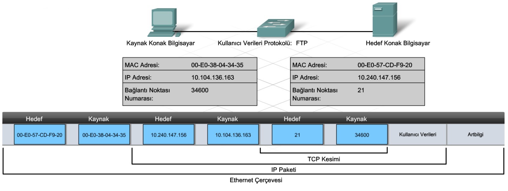

# 6. Ağ Hizmetleri

**İstemci**, birisinin sunucuda bulunan bilgilere erişmek için kullandığı bilgisayar uygulamasına verilen addır.

**Sunucu**, ağa bağlı diğer konak bilgisayarlara bilgi veya hizmet sağlayan bir yazılım uygulamasını çalıştıran konak bilgisayarları ifade eder.

#### 6.1.1 İstemci Sunucu İlişkisi

**DNS Sunucusu**: Konak bilgisayarın bağlanabilmesi için bir web sitesinin veya etki alanı adının IP adresini sunan hizmet.

**Telnet Sunucusu**: Yöneticilerin uzak bir konumdaki konak bilgisayarda oturum açabilmesini ve yerel olarak oturum açmış gibi konak bilgisayarı denetleyebilmesini sağlayan hizmet.

**E-posta Sunucusu**: SMTP, POP3, IMAP. İnternet üzerinden, istemcilerden sunuculara e-posta iletileri göndermek için kullanılır. Alıcılar, kullanici@xyz biçimi kullanılarak belirtilir.

**DHCP Sunucusu**: İstemcilere IP adresi, alt ağ maskesi, varsayılan ağ geçidi ve diğer bilgileri atayan hizmet.

**Web Sunucusu**: HTTP. 

**FTP Sunucusu**: Bir istemci ile sunucu arasında dosya indirme ve yükleme işlemlerine olanak veren hizmet.

#### 6.1.2 İstemci Sunucu İletişiminde Protokollerin Rolü

**HTTP (Hyper Text Transfer Protocol)**: Web sayfası isteğinin (istemciden) ve yanıtın (sunucudan) biçimini belirtir.

**TCP (Transmission Control Protocol)**: Akış denetimini ve paket değişimi *alındı bildirimlerini* belirler. İletiyi kesim(segment) olarak bilinen küçük parçalara ayırır. Kesimler sırayla numaralandırılır ve paketler halinde birleştirilmek üzere IP işlemine geçer. TCP, belirli bir uygulamadan belirli bir konak bilgisayara gönderilen kesimlerin sayısını takip eder. Gönderen belirli bir süre içinde alındı bildirimi almazsa, kesimlerin kaybolduğunu varsayarak kesimleri yeniden iletir. İletinin tamamı değil, yalnızca kaybolan kısmı yeniden gönderilir. Alıcı konak bilgisayarda TCP, ileti kesimlerinin yeniden birleştirilip uygulamaya gönderilmesinden sorumludur.

**IP (Internet Protocol)**: Paketler ağ üzerinden gönderilirken kaynağı ve hedefi tanımlar. Paketlerin yapısı, adreslenmesi ve yönlendirilmesiyle ilgilidir.

#### 6.1.4 TCP/IP Bağlantı Noktası Numaraları

TCP veya UDP kullanılarak bir ileti teslim edildiğinde, istenen protokoller ve hizmetler *bağlantı noktası (port)* numarasıyla tanımlanır. Bağlantı noktası, belirli iletişimlerin ve istenen hedef hizmetlerin takip edilmesi için kullanılan ve her kesim içinde yer alan sayısal bir tanıtıcıdır. Bir konak bilgisayarın gönderdiği her iletide hem kaynak hem de hedef bağlantı noktası yer alır.

**Hedef Bağlantı Noktası**

İstemci, hedef sunucuya hangi hizmetin istendiğini bildirmek için kesime bir hedef bağlantı noktası numarası yerleştirir. 80 HTTP'yi yani weble ilgili bir içeriği, 21 ise FTP bağlantısını temsil eder. Bir sunucu, aynı anda birden çok hizmet sunabilir.

**Kaynak Bağlantı Noktası**

Kaynak bağlantı noktası, iki aygıt arasındaki iletişimi tanımlamak için *gönderen aygıt tarafından rastgele* oluşturulur. Bu bağlantı noktası, aynı anda birden çok iletişimin oluşmasına izin verir. Kaynak bağlantı noktaları temel alınarak ayrı iletişimler takip edilebilir.

Kaynak ve hedef IP adresi ile kaynak ve hedef bağlantı noktası numarasının birleşimine (IP + PORT) **soket (socket)** denir. Sunucuyu ve istemci tarafından istenen hizmeti tanımlamak için soket kullanılır. 

#### 6.2.1 Etki Alanı Adlandırma Hizmeti (DNS)

Etki Alanı Adlandırma Sistemi (DNS), konak bilgisayarların belirli bir sunucun IP adresini istemek için bu adı kullanmasını sağlar (google.com = 172.217.169.174). DNS adları, İnternet'te belirli üst seviyeli grup veya etki alanları içinde kayıtlı ve düzenlenmiş durumdadır. 

DNS sunucusunda, etki alanındaki konak bilgisayar adlarını karşılık gelen IP adresleriyle ilişkilendirilen bir tablo yer alır. Yerel DNS sunucusunda, istenen ada ilişkin giriş yoksa, sunucu etki alanı içindeki başka bir DNS sunucusunu sorgular. DNS sunucusu IP adresini belirleyemezse, istek zaman aşımına uğrar ve istemci web sunucusuyla iletişim kuramaz.

#### 6.2.3 FTP İstemcileri ve Sunucular

FTP oturumu başlatma istekleri, hedef bağlantı noktası 21 kullanılarak sunucuya gönderilir. Oturum açıldıktan sonra sunucu, veri dosyalarını aktarmak için bağlantı noktası 21'i bağlantı noktası 20 ile değiştirir.

FTP istemci yazılımı bilgisayar işletim sistemine ve çoğu web tarayıcısına yerleşik durumdadır.

#### 6.2.4 E-Posta İstemcileri ve Sunucuları

#### Bağlantı Noktası Numaraları

Bağlantı noktaları, İnternet Tahsisli Sayılar ve İsimler Kurumu (Internet Corporation for Assigned Names and Numbers - ICANN) olarak bilinen bir kuruluş tarafından atanır ve yönetilir.

Yaygın Olarak Bilinen Bağlantı Noktaları **(1-1023 aralığı)**

Kayıtlı Bağlantı Noktaları **(1024 - 49151 aralığı)**

Özel Bağlantı Noktaları (Herhangi bir uygulama tarafından kullanılabilirler.) **(49152 - 65535 aralığı)**	

| Destination Port Number | Abbreviation   | Definition                                       |
| ----------------------- | -------------- | ------------------------------------------------ |
| 20                      | FTP Data       | File Transfer Protocol (for data transfer)       |
| 21                      | FTP Control    | File Transfer Protocol (to establish connection) |
| 23                      | TELNET         | TELetype NETwork                                 |
| 25                      | SMTP           | Simple Mail Transfer Protocol                    |
| 53                      | DNS            | Domain Name Service                              |
| 67                      | DHCP v4 Client | Dynamic Host Configuration Protocol (Client)     |
| 68                      | DHCP v4 Server | Dynamic Host Configuration Protocol (Server)     |
| 69                      | TFTP           | Trivial File Transfer Protocol                   |
| 80                      | HTTP           | Hypertext Transfer Protocol                      |
| 110                     | POP3           | Post Office Protocol (version 3)                 |
| 137                     | NBNS           | Microsoft NetBIOS Name Service                   |
| 143                     | IMAP4          | Internet Message Access Protocol (version 4)     |
| 161                     | SNMP           | Simple Network Management Protocol               |
| 443                     | HTTPS          | Hypertext Transfer Protocol Secure               |

#### 6.3.1 Protokol Etkileşimi

Katmanlı modelin birçok avantajı vardır:

- Farklı satıcıların ürünleri birlikte çalışabildiğinden rekabete teşvik eder.
- Bir katmandaki teknoloji veya yetenek değişikliğinin yukarıda ya da aşağıdaki diğer katmanları etkilemesini önler.
- Ağ iletişim işlevlerini ve yeteneklerini açıklamak için ortak bir dil sağlar.

#### 6.3.2 İleti Gönderme ve Alma Sırasında Protokolün Çalışması

Bir ağda **ileti gönderilirken**, konak bilgisayardaki protokol yığını **yukarıdan aşağıya** çalışır. 

1. Web sayfası, web sunucusu protokol yığınına gönderilirken, uygulama verileri de **TCP kesimlerine** ayrılır. **Her TCP kesimine kaynak ve hedef bağlantı noktasını içeren bir başlık** verilir. TCP kesimi HTTP protokolünü ve web sayfası HTML kullanıcı verilerini **kapsülleyip** bir sonraki protokol katmanına **(IP) gönderir**. 
2. IP katmanında, TCP kesimi bir IP paketine kapsüllenir ve bu işlem sonucunda **kaynak ve hedef IP adreslerinin bulunduğu bir IP başlığı** eklenir. 
3. IP paketi Ethernet protokolüne gönderilir ve burada bir çerçeve başlığında ve artbilgide (*trailer, the control information appended to data when data is encapsulated for network transmission*) kapsüllenir. Her Ethernet çerçeve başlığında bir kaynak ve hedef MAC adresi bulunur. Artbilgide hata denetleme bilgileri yer alır.
4. Sunucu NIC'si tarafından bit'ler Ethernet ortamına kodlanır.

Bir ağda ileti alınırken, konak bilgisayardaki protokol yığını **aşağıdan yukarıya** çalışır.

#### 6.3.3 Açık Sistem Arabağlantısı Modeli (OSI - Open Systems Interconnect Model)

1984'te Uluslararası Standartlar Örgütü (ISO) tarafından geliştirilmiştir. TCP/IP modelinden farklı olarak, bu model belirli protokollerin etkileşimini belirtmez. İşlevlerin ayrılması, yığındaki her bir katmanın diğerlerinden bağımsız olarak çalışmasını sağlar. 

#### ÖZET

- TCP ve UDP gibi taşıma protokolleri, sunucular ve istemciler arasındaki her bir iletişimi yönetebilmek için **bağlantı noktası numaraları (port)** tanımlar.
- IP, verilerin paketler halinde kapsüllenme şeklini ve mantıksal adresleme işlemini belirler.
- Ethernet gibi ağ erişim protokolleri iki temel işlevi açıklar: veri bağı yönetimi ve fiziksel ağ iletimleri.

