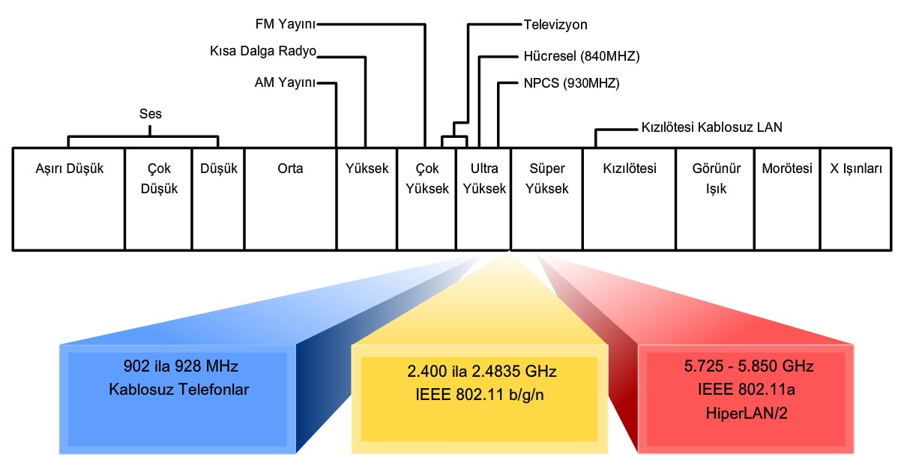
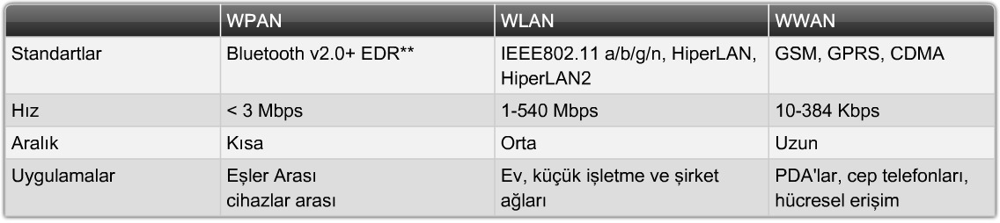
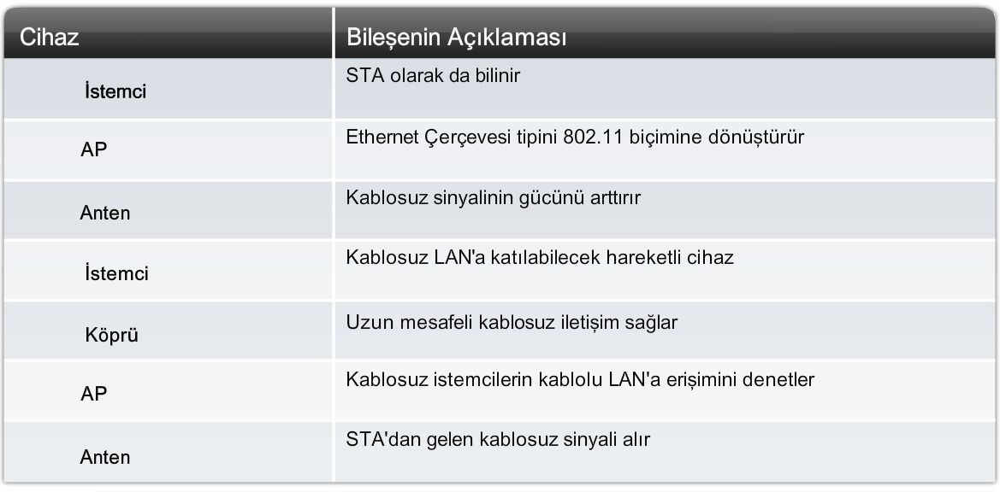
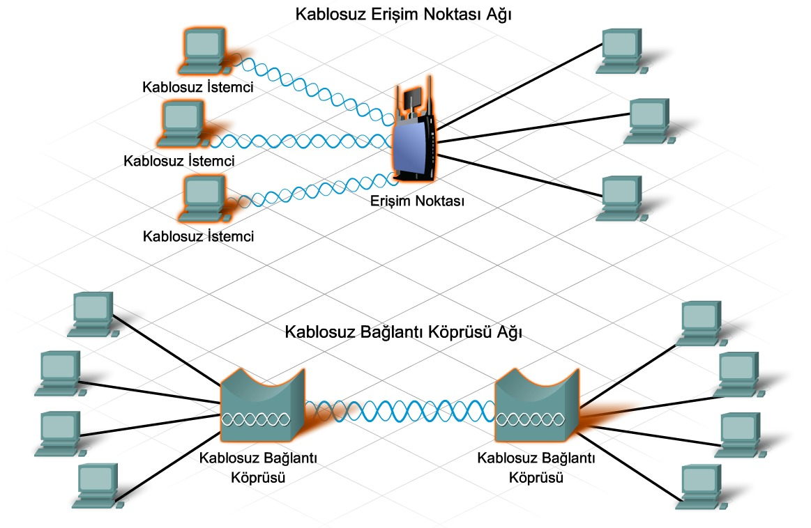
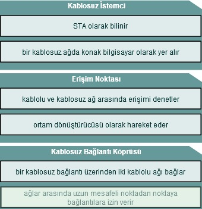
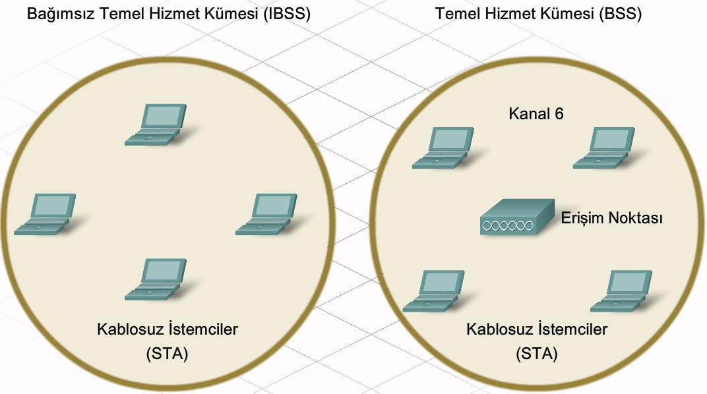
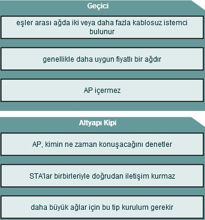
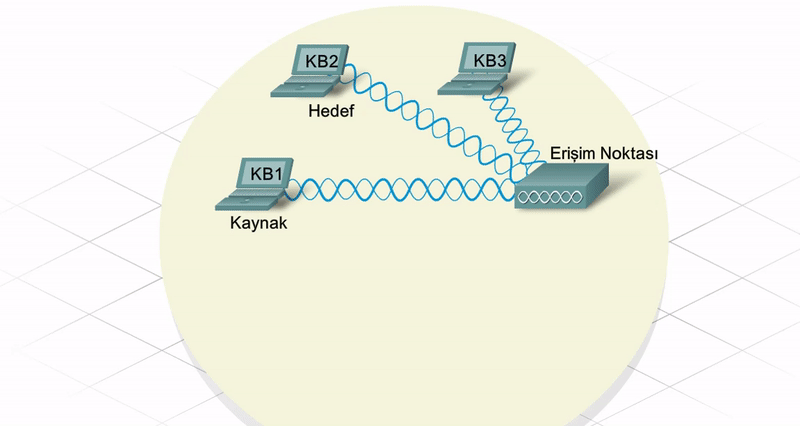
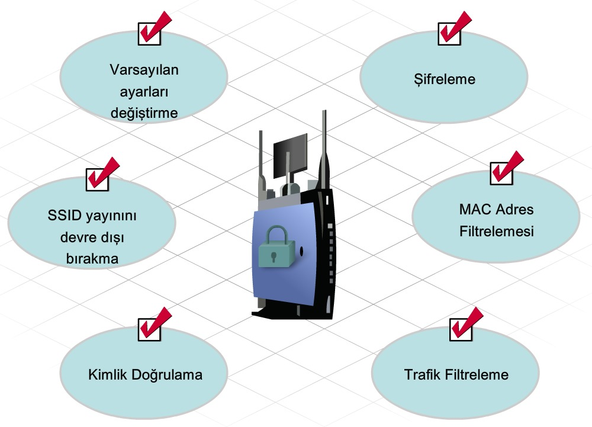

# 7. Kablosuz Teknolojiler

Genel kablosuz iletişim için kullanılan en yaygın dalga boyları arasında **Kızılötesi** ve **Radyo Frekansı (RF)** bandının bir bölümü yer alır.

#### 7.1.1 Kablosuz Teknolojiler ve Cihazlar

Kızılötesi (IR - InfraRed), duvar veya diğer nesnelerden geçemez. Birebir bağlantı türüne izin verir. Genellikle kısa aralıklı ve görüş alanı içindeki iletişimler için kullanılır. 

Radyo frekansı (RF - Radio Frequency), duvarlardan ve diğer nesnelerden geçebilir.

Bluetooth, 2.4 GHz bant kullanan bir teknolojidir ve aynı anda birçok aygıtla iletişim kurma avantajı vardır.

#### 7.1.2 Kablosuz Teknolojilerin Avantajları ve Sınırlamaları

- **Hareketlilik ve Esneklik**: Her zaman her yerde bağlantı sağlama yeteneği.
- **Ölçeklenirlik**: Ağların bağlantı sınırlamaları olmadan kolayca genişleyebilirler.
- **Azalan Kurulum Süresi ve Maliyet Tasarrufu**: Kurulum oldukça kolay ve uygun fiyatlı.
- **Zor Koşullarda Güvenilirlik**:Yeni kullanıcılar hızlı ve kolayca ağa girebilir.

-Kablosuz LAN (WLAN) teknolojileri, RF tayfının lisanssız bölgelerini kullanır. Bu bölgeler düzenlenmemiş nitelikte olduğundan birçok farklı aygıt bu bölgeleri kullanır. Sonuç olarak bu bölgeler tıkanır ve farklı aygıtlardan gelen sinyaller birbirine girişimde bulunabilir.

-Kablosuz bağlantı erişim kolaylığı sağladığından, verilerin herkese erişim yeteneği sağlayacak biçimde yayınlanmasıyla sağlanır. İstenmeyen alıcılar da dahil, herkesin iletişim akışına müdahale etmesine izin verir. Bunlara engel olmak için **şifreleme ve kimlik doğrulama** gibi teknikler geliştirilmiştir.

#### 7.1.3 Kablosuz Ağ Türleri ve Sınırları

#### 7.2.1 Kablosuz LAN Standartları

IEEE 802.11 standardı WLAN ortamını yönetir. Wi-Fi Alliance olarak bilinen başka bir kuruluş da farklı üreticilerin kablosuz LAN aygıtlarının test edilmesinden sorumludur. Bir cihazdaki Wi-Fi logosu, o ekipmanın standartları karşıladığı ve aynı standartlara sahip diğer cihazlarla birlikte çalışabileceği anlamına gelir.

| Standart | Frekans                | Veri Hızı (Maks) | Ek bilgiler                                                  |
| -------- | ---------------------- | ---------------- | ------------------------------------------------------------ |
| 802.11 a | 5 GHz                  | 54 Mbps          | 2.4 GHz (b/g/n) ile uyumlu değildir. Diğerlerine göre daha maliyetlidir. |
| 802.11 b | 2.4 GHz                | 11 Mbps          | İç mekanda 46m, dış mekanda 100m etki alanı.                 |
| 802.11 g | 2.4 GHz                | 54 Mbps          | Dış mekanda 100m etki alanı.                                 |
| 802.11 n | 2.4 Ghz **veya** 5 Ghz | 540 Mbps         | Dış mekanda 250m etki alanı.                                 |

#### 7.2.2 Kablosuz LAN Bileşenleri

**Kablosuz İstemci**: Kablosuz ağa katılabilen herhangi bir konak bilgisayar. Yaygın olarak istasyonun (STAtion) kısaltması olan STA şeklinde bilinir.

**Erişim Noktası**: Kablolu ve kablosuz ağ arasındaki erişimi denetler.

**Kablosuz Bağlantı Köprüsü**: Kablosuz bağlantı yoluyla iki kablolu ağı birbirine bağlamak için kullanılır.

#### 7.2.3 WLAN'lar ve Hizmet Kümesi Tanımlayıcılar (SSID - Service Set Identifier)

SSID en fazla 32 karakterden oluşan büyük/küçük harf duyarlı, alfasayısal bir dizgidir. WLAN üzerinden iletilen tüm çerçevelerin başlığında gönderilir. Kablosuz cihazlara hangi WLAN'a ait olduklarını ve başka hangi cihazlarla iletişim kurabileceklerini söylemek için SSID kullanılır.

**Temel WLAN Kurulum Biçimi 1: Geçici Kip (AP içermeyen)**

*İki veya daha fazla kablosuz istemciyi eşler arası bir ağda birbirine bağlama* yoluyla en basit kablosuz ağ biçimi oluşturulur. Tüm istemciler eşittir. Bu ağın kapsadığı alan Bağımsız Temel Hizmet Kümesi (Independent Basic Service Set) denir.

**Temel WLAN Kurulum Biçimi 2: Altyapı Kip (AP içerir)**

Büyük ağlar için kablosuz hücrede iletişimleri denetleyen tek bir aygıt gereklidir. Varsa bir AP bu rolü üstlenir ve kimin ne zaman konuşacağını denetler. STA'lar doğrudan birbirleriyle iletişim kuramaz. Her aygıtın iletişim kurmak için AP'den izin alması gerekir. Tek bir AP'nin kapsadığı alana Temel Hizmet Kümesi (Basic Service Set) denir.

#### 7.2.4 Kablosuz Kanallar

WLAN içinde iyi tanımlanmış sınırların olmaması, iletim sırasında çatışma oluşup oluşmadığının saptanmasını imkansız hale getirir. Bu nedenle, çatışma oluşmamasını sağlayacak bir kablosuz ağda erişim yönteminin kullanılması gerekir.

Kablosuz teknoloji, CSMA/CA (Carrier Sense Multiple Access With Collision Avoidance) kullanarak belirli bir iletişim tarafından kullanılması için kanalda bir koruma oluşturur. Koruma bulunurken başka bir aygıt kanalda iletim yapamaz ve böylece olası çatışmalar önlenir.

#### 7.3.3 WLAN'da Kimlik Doğrulaması

Kullanıcı adı ve parola kullanımı en yaygın kimlik doğrulama biçimidir. Açık kimlik doğrulama, ön paylaşımlı anahtarlar (PSK - Preshared Keys) ve genişletilebilir kimlik doğrulama protokolü (EAP - Extensible Authentication Protocol) olmak üzere üç tür kablosuz kimlik doğrulama yöntemi vardır.

1. **Açık Kimlik Doğrulama**: Tüm istemciler kim olduklarına bakılmaksızın ilişkilendirilebilirler (ağa bağlanabilirler).
2. **Ön Paylaşımlı Anahtarlar (PreShared Keys)**: Aynı anahtar ile AP ve istemci yapılandırılmıştır. Tek yönlü kimlik doğrulaması yapar. PSK konak bilgisayarda AP'nin kimlik doğrulamasını ve konak bilgisayarın gerçek kulanıcısının kimlik doğrulamasını yapmaz.
3. **Genişletilebilir Kimlik Doğrulama Protokolü (EAP)**: Kullanıcı kimlik doğrulamasının yanı sıra, karşılıklı veya iki yönlü kimlik doğrulaması sağlar. RADIUS ağa erişebilen geçerli kullanıcıların bir veritabanını korur.

#### 7.3.4 WLAN'da Şifreleme

Kimlik doğrulama ve MAC filtreleme, saldırganların kablosuz ağa bağlanmasını durdurur ancak iletilen verilere müdahale edebilmelerini önleyemez. Şifreleme, verilerin müdahale edilse bile kullanılmayacak biçime dönüştürülme işlemidir.

**Kabloluya Eş Gizlilik Protokolü (WEP - Wired Equivalency Protocol)**: verileri şifrelemek ve verilerin şifresini çözmek için **önceden yapılandırılmış anahtarları** kullanır.

**Wi-Fi Korumalı Erişim (WPA - WiFi Protected Access)**: bir istemci AP ile her bağlantı kurduğunda yeni ve dinamik anahtarlar oluşturur. 

