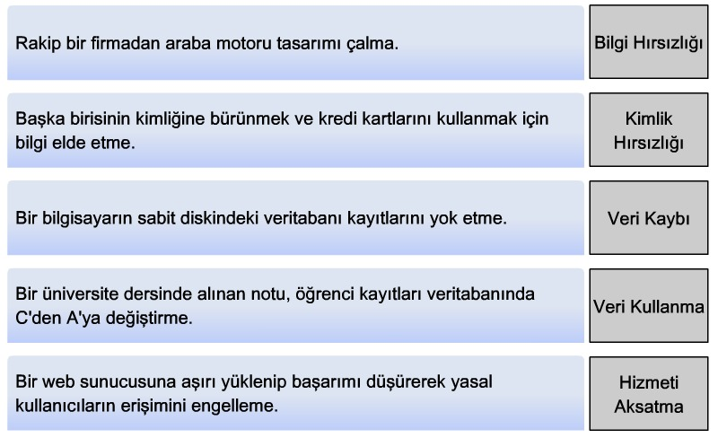
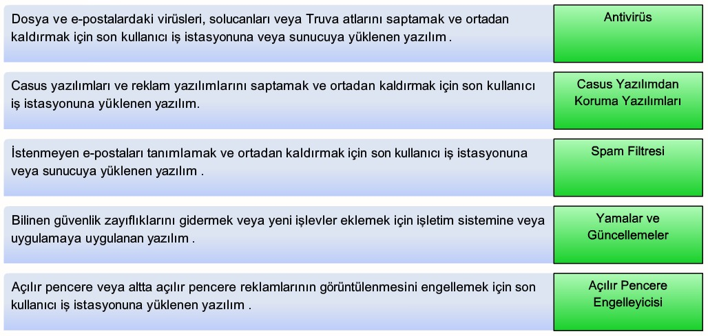
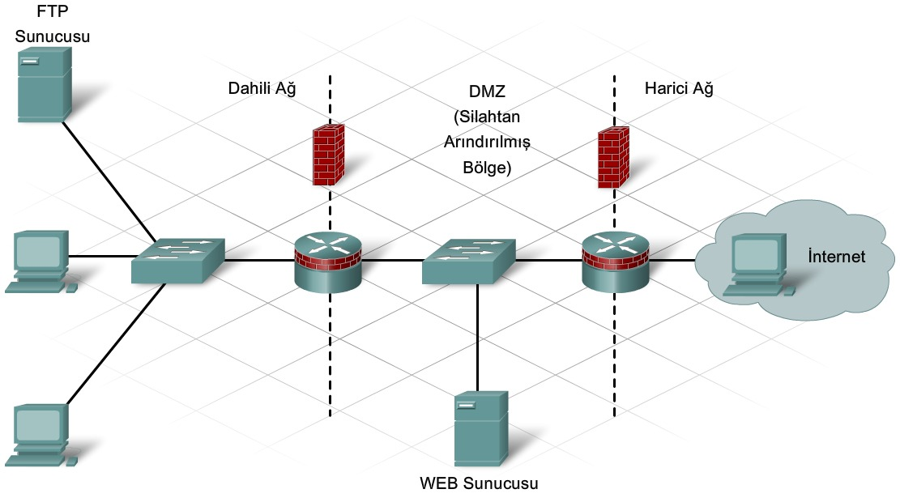
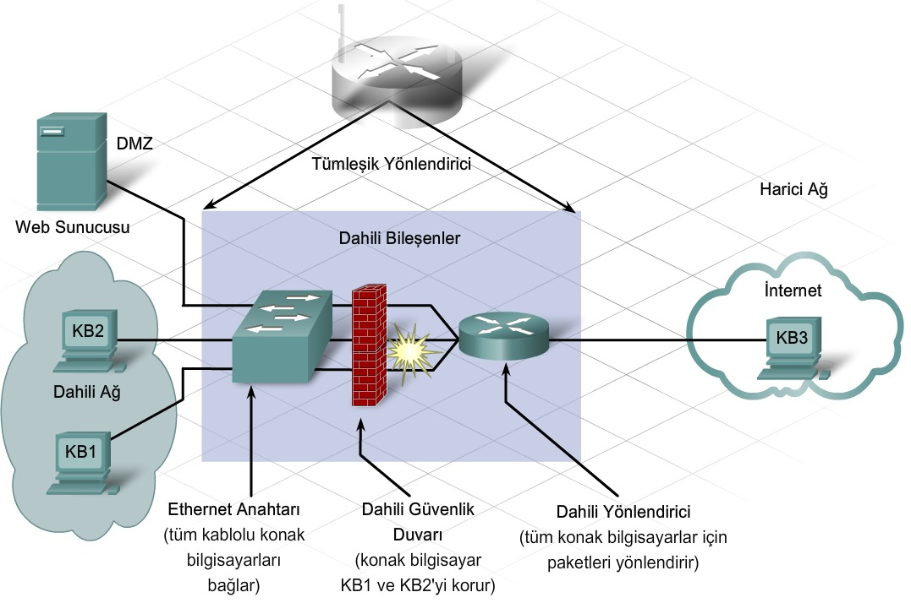

# 8. Temel Güvenlik

#### 8.1.3 Sosyal Mühendislik ve Oltalama (Phishing)

Sosyal mühendislik, bir kişinin veya bir grup insanın davranışını etkileme yeteneğini ifade eden bir terimdir. Bilgisayar ve ağ güvenliği bağlamında ele alınırsa, dahili kullanıcıları belirli eylemleri gerçekleştirmesi veya gizli bilgileri açıklaması için aldatmak amacıyla kullanılan teknikler bütünüdür.

1. **Sahne Senaryo Uydurma**: Kurban hakkında uydurulmuş bir senaryo kullanılır. Genellikle telefon üzerinden iletişim kurulur.
2. **Oltalama (Phishing)**: Kimlik avcısının geçerli bir dış kuruluşu temsil ediyor gibi davrandığı bir sosyal mühendislik biçimidir. Genellikle e-posta üzerinden iletişim kurulur.
3. **Sesle / Telefonla Oltalama (Vishing)**: Güvenilir bir kullanıcıya geçerli bir telefon bankacılığı hizmeti gibi görünen bir numarayı aramasını bildiren sesli mesaj gönderilir. IP üzerinden ses (VoIP - Voice over IP).

#### 8.2.1 Virüsler, Solucanlar ve Truva Atları

1. **Virüsler**: Bir kez **etkinleştirildiğinde** diğer programları veya dosyaları değiştirerek, dosyalara zarar vererek veya onları **tamamen silerek** hızla yayılan programlardır.
2. **Solucanlar**: Kendini var olan bir programa eklemesi gerekmez. Kendi kopyalarını tüm bağlı konak bilgisayarlara göndermek için **ağı** kullanır. *Her zaman* etkinleştirme veya insan müdahalesi gerektirmez.
3. **Truva Atları**: Geçerli bir program gibi görünen ancak bir saldırı aracı olan ve kendiliğinden çoğalmayan bir programdır. Arka kapı (backdoor) oluşturabilirler.

#### 8.2.2 Hizmet Reddi ve Deneme Yanılma  Saldırıları

**DoS (Denial of Service)**: Geçerli ağ trafiği akışını önlemek için sistem veya ağ trafiğini taşırma ve bir hizmete erişimi önlemek için istemci ile sunucu arasındaki bağlantıyı yok etme.

1. **SYN (eş zamanlı) Taşma**: Sunucuya gönderilen ve istemci bağlantısı isteyen paket taşmasıdır. Paketlerde geçersiz kaynak IP adresleri yer alır. Sunucu sahte isteklere yanıt vermekle uğraşırken geçerli isteklere yanıt veremez.
2. **Ping of Death**: Bir cihaza, IP tarafından izin verilen maksimum boyuttan (65,535 Byte) büyük bir paket gönderilir. Bu da alıcı sistemin çökmesine neden olabilir.

**DDoS (Distributed Denial of Service)**: Genellikle yüzlerce veya binlerce saldırı noktası aynı anda bir hedefie çökertmeye çalışır. 

**Deneme Yanılma (Brute Force)**: Hızlı bir bilgisayar, parolaları tahmin etmeye veya bir şifreleme kodunun şifresini çözmeye çalışmak için kullanılır. Belirli bir kaynakta aşırı trafik oluşması nedeniyle veya kullanıcı hesaplarının kilitlenmesiyle hizmet reddine yol açabilir.

#### 8.2.3 Casus Yazılım, İzleme Tanımlama Bilgileri, Reklam Yazılımı ve Açılır Pencereler

**Casus Yazılım (Spyware)**: İzniniz veya bilginiz olmadan bilgisayarınızdan *kişisel bilgi toplayan herhangi bir programdır*. Bu bilgiler reklam veren kişi ya da kuruluşlara veya İnternet'teki diğer kişilere gönderilir ve parola, hesap numarası gibi bilgileri de içerebilir.

**İzleme Tanımlama Bilgileri (Tracking Cookies)**: Bir internet kullanıcısı web sitelerini ziyaret ettiğinde o kullanıcıya ilişkin bilgileri kaydetmek için kullanılır.

**Reklam Yazılımları (Adware)**: Kullanıcının ziyaret ettiği web siteleri temel alınarak kullanıcı hakkında bilgi toplamak için kullanılan bir casus yazılım biçimidir. Bu bilgiler daha sonra hedeflenmiş reklamcılık için kullanılır.

**Açılır pencereler ve altta açılır pencereler**: Reklam yazılımından farklı olarak, açılır pencereler kullanıcı hakkında bilgi toplamak için tasarlanmamış olup genellikle yalnızca ziyaret edilen web sitesiyle ilgilidir.

#### 8.2.4 Spam

Satıcılar bazen hedeflenmiş pazarlamayla uğraşmak yerine ürünün birilerinin ilgisini çekmesi umuduyla e-posta reklamlarını olabildiğince fazla son kullanıcıya göndermek isterler. Yaygın olarak görülen bu İnternet'te pazarlama yaklaşımına **spam** adı verilir.

Spam, internet hizmet sağlayıcılarını (ISP - Internet Service Provider), e-posta sunucularını ve tek tek son kullanıcı sistemlerini aşırı yükleyebilen ciddi bir ağ tehdidir.

#### 8.3.1 Yaygın Güvenlik Önlemleri

Güvenlik riskleri tamamen ortadan kaldırılamaz veya önlenemez. Güvenlik ilkesi, kullanıcıların teknolojiye veya bilgi varlıklarına erişirken uyması gereken kuralların resmi ifadesidir.

1. **Tanımlama ve Kimlik Doğrulama İlkeleri**: Kaynaklara erişecek yetkili kişiler belirlenir. 
2. **Parola İlkeleri**: Parolaların minimum gereksinimleri karşılamasını ve düzenli aralıklarla değiştirilmesini sağlar.
3. **Kabul Edilebilir Kullanım İlkeleri**
4. **Uzakten Erişim İlkeleri**: Uzak kullanıcıların ağa nasıl erişebileceğini ve uzaktan bağlantıyla nelerin erişilebilir olacağını tanımlar.
5. **Ağ Bakım Yordamları**: Ağ cihazı işletim sistemlerini ve son kullanıcı uygulamalarını güncelleme yordamlarını belirler.
6. **Olay İşleme Yordamları**: Güvenlik olaylarının nasıl işleneceğini açıklar.

#### 8.3.2 Güncellemeler ve Yamalar

Yama, belirli bir sorunu çözen küçük bir koddur. Güncelleme ise, belirli sorunlara yönelik yamaların yanı sıra yazılım paketine yönelik işlevleri de içerebilir.

#### 8.3.3 Antivirüs Yazılımı

Hem önleyici amaçlı hem de sorun çıktığında kullanılabilen bir araçtır. E-posta denetleme, yerleşik dinamik tarama, zamanlanmış taramalar ve otomatik güncelleştirmeler.

#### 8.3.4 Spam Önleme

Konak bilgisayar, kullanıcının bilgisi olmadan spam posta göndermek için kullanılır. Bu şekilde virüs bulaşmış bilgisayarlara **Spam değirmeni** denir.

#### 8.4.1 Güvenlik Duvarı Nedir?

Güvenlik duvarı, iki veya daha fazla ağ arasında yerleşik olup bunlar arasındaki trafiği denetler ve yetkisiz erişimin önlenmesine yardımcı olur. Kısaca, ağa gelen ve ağdan giden trafiği denetler. NAT (Network Address Translation) kullanır.

1. **Paket Filtreleme**: IP ve MAC adreslerini temel alarak erişimi önler veya erişime izin verir.
2. **Uygulama / Web Sitesi Filtreleme**: Uygulamayı temel alarak erişimi önler veya erişime izin verir. Bir web sitesi URL adresi veya anahtar sözcükleri belirtilerek web siteleri engellenebilir.
3. **Durumlu Paket İncelemesi (SPI)**: Gelen paketlerin, dahili konak bilgisayarların isteklerine ilişkin geçerli yanıtlar olması gerekir. İstenmeyen paketler, özel olarak izin verilmedikleri sürece engellenir. DoS gibi belirli saldırı türlerini tanıma ve filtreleme yeteneğine de sahip olabilir.

#### 8.4.2 Güvenlik Duvarı Kullanma

Dahili ağ (intranet) ile İnternet arasında sınır aygıtı olarak güvenlik duvarının yerleştirilmesiyle, İnternet'e giden ve İnternet'ten gelen tüm trafik izlenebilir ve denetlenebilir. Böylece, dahili ve harici ağ arasında net bir savunma hattı oluşturulur. 

Dahili kaynaklara erişmek isteyen müşteriler için **silahtan arındırılmış bölge (DMZ - Demilitarized Zone)** yapılandırılabilir. Bilgisayar ağ iletişiminde DMZ hem dahili hem harici kullanıcıların erişebildiği ağ alanını ifade eder.

Tek güvenlik duvarı yapılandırması, daha küçük ve daha az tıkanan ağlar için uygundur. Ancak tek güvenlik duvarı yapılandırmasının tek bir hata noktası yoktur ve aşırı yüklenme olasılığı vardır. İkili güvenlik duvarı yapılandırması, çok fazla trafik işleyen daha büyük ve daha karmaşık ağlar için uygundur.

Tümleşik yönlendirici kullanılarak, dış konak bilgisayarların dahili sunucuya erişmesine izin veren basit bir DMZ kurulabilir. Bunun için sunucu, DMZ yapılandırmasında bir statik IP adresinin belirtilmesini gerektirir.

