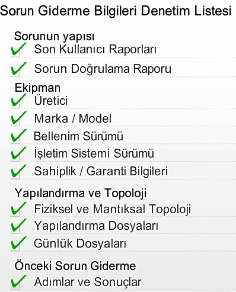
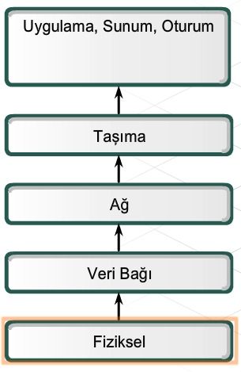
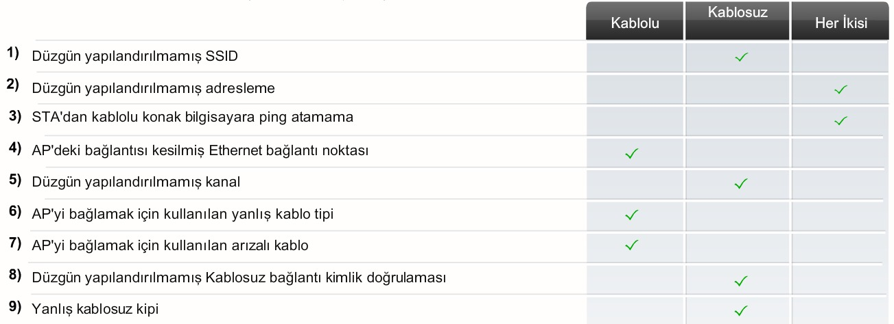

# 9. Ağınızın Sorunlarını Giderme

Bir sorun bildirildiğinde, bunu doğrulayın ve kapsamını belirleyin. Sorun onaylandıktan sonra, sorun giderme sırasında atılacak ilk adım bilgi toplamadır.

#### 9.1.2 Bilgi Toplama

#### 9.1.3 Sorun Gidermeye İlişkin Yaklaşımlar

| Sorun Giderme Yaklaşımı | Çalışma Şekli                                                | Uygun Olduğu Durumlar                                        | Avantaj / Dezavantaj                                         |
| ----------------------- | ------------------------------------------------------------ | ------------------------------------------------------------ | ------------------------------------------------------------ |
| Yukarıdan aşağıya       | Her zaman uygulama katmanından başlar ve hatalı katmanı buluncaya kadar aşağı doğru ilerler. | Basit sorunlar için veya uygulama/kullanıcı ya da üst katman ile ilgili olduğundan şüphelenilen sorunlar için daha uygundur. | Sorunun alt katmanlarla ilişkili olduğu ortaya çıkarsa, üst katmanlarda veya uygulama katmanlarında çok fazla vakit kaybetmiş ve boşuna çaba harcamış olursunuz. |
| Böl ve yönet            | Söz konusu durumlara ve deneyimlerinize bağlı olarak, herhangi bir katmandan başlayıp OSI yığınında yukarı veya aşağı doğru ilerlemeye karar verebilirsiniz. | Deneyimliyseniz ve sorunun belirtileri açıksa en uygun yaklaşım budur. | Diğer yaklaşımlarla karşılaştırıldığında sorunlu katmana daha hızlı ulaşır. |
| Aşağıdan yukarıya       | Her zaman fiziksel katmandan başlar ve hatalı katmanı buluncaya kadar yukarı doğru ilerler. | Karışık durumlar için daha uygundur.                         | Yavaş, ancak sağlam bir yaklaşımdır. Sorun, uygulama (veya üst katman) ile ilgiliyse bu yaklaşımın kullanılması uzun zaman alabilir. |
| Deneme ve Yanılma       | Sorunun en olası nedenini belirlemek için kişisel bilgiye dayanır. | Deneyimliyseniz.                                             | Çok hızlı olabilse de, sorun gidericinin yetenekleri ve deneyimlerine bağlıdır; yanlış varsayımlar ve basit çözümlerin gözden kaçırılmasıyla da sonuçlanabilir. |
| Değiştirme              | Sorunun belirli bir donanım bileşeni veya yapılandırma dosyasından kaynaklandığı varsayılır. Hatalı bölüm veya kod bilinen iyi bir aygıt veya dosyayla değiştirilir. | Değiştirilecekler ucuzsa.                                    | Hızlıdır ancak maliyetlidir.                                 |

#### 9.2.2 Bağlantı Sorunlarını Gidermek İçin Kullanılan Yazılım Programları

| Komut    | Amacı                                                        | Örnek / Neden                                                |
| -------- | ------------------------------------------------------------ | ------------------------------------------------------------ |
| ipconfig | IP yapılandırma bilgisini görüntüler. IP adresi, alt ağ maskesi ve varsayılan ağ gecidi görüntülenir. | Doğru IP adresine ve alt ağ maskesine sahip miyim? Bir konak bilgisayar uygun IP yapılandırması olmadan ağdaki iletişime katılamaz. Konak bilgisayar DNS sunucularının yerini bilmiyorsa adları IP adreslerine çeviremez. |
| ping     | Diğer IP tabanlı konak bilgisayarlara bağlantı sınar. Genellikle dört yankı oluşturur ve her biri için yanıt bekler. | Başka bir konak bilgisayara IP paketi gönderebilir miyim? Ip adresine atılan ping başarılı olur fakat ada atılan olmazsa, DNS ile ilgili bir sorun vardır. |
| tracert  | Hedefe giden rotayı görüntüler. Paketin kaynaktan her yönlendiriciye ve geriye gitmek için ne kadar zaman harcadığını gösterir (tur süresi). | Paketlerim başka bir konak bilgisayara giderken hangi yolu izleyecek ve her bir sekmede ne kadarlık bir gecikme olacak? |
| netstat  | Ağ bağlantılarını görüntüler.                                | Etkin ağ bağlantılarım nelerdir ve şu an hangi TCP/UDP bağlantı noktaları kullanılmaktadır? |
| nslookup | Hedef etki alanı hakkında bilgi almak için adlandırma sunucularını doğrudan sorgular. | google.com adresinin IP adresi nedir?                        |

#### 9.3.1 Bağlantı Sorunları

1. **Kablosuz istemciden varsayılan ağ geçidine ping** atın, bu **kablosuz** istemcinin beklenen şekilde bağlanıp bağlanmadığını doğrular.
2. **Kablolu istemciden varsayılan ağ geçidine ping** atın, bu **kablolu** istemcinin beklenen biçimde bağlanıp bağlanmadığını doğrular.
3. **Kablosuz istemciden kablolu istemciye ping** atın, bu **tümleşik** yönlendiricinin beklenen biçimde çalışıp çalışmadığını doğrular.

Kablolama için dikkat edilmesi gerekenler:

1. Doğru tip kabloyu kullandığınızdan emin olun. Ağ bağlantısında çoğunlukla iki tip UTP kablosu görülür: Düz kablolar ve çapraz kablolar. Yanlış tipi kullanmak bağlantıyı engelleyebilir.
2. Yanlış kablo sonlandırması ağlarda karşılaşılan temel sorunlardan biridir.
3. Maksimum kablo uzunlukları değişik kabloların özelliklerine bağlıdır. Bu uzunlukları aşmanın ağ başarımı üzerinde ciddi olumsuz etkisi olabilir.
4. Eğer bağlantı bir sorun ise ağ aygıtları arasında doğru bağlantı noktalarının kullanıldığından emin olun.
5. Kabloları ve bağlayıcıları fiziksel hasardan koruyun.

Kablosuz bağlantı için dikkat edilmesi gerekenler:

1. Bütün kablosuz standartları uyumlu değildir. 2.4 GHz bandı içerisinde her standart farklı teknoloji kullanır. 
2. Her kablosuz iletişim ayrı, örtüşmeyen kanallarda gerçekleşmelidir.
3. RF sinyalinin gücü mesafe arttıkça düşer. Eğer sinyal gücü çok düşük ise, aygıtlar güvenilir bir şekilde ilişki kuramaz ve veri taşıyamaz.
4. RF sinyalleri aynı frekansta çalışan başka aygıtlar dahil olmak üzere dış kaynaklardan gelen girişimlere karşı hassastır. Bunu belirlemek için yerinde inceleme yapılmalıdır.
5. AP'ler mevcut bant genişliğini aygıtlar arasında paylaştırırlar. AP ile daha çok aygıt ilişkilendirildikçe her bir aygıt için bant genişliği azalır ve bu ağ başarım sorunlarına yol açar.
6. SSID, en fazla 32 karakterden oluşan büyük/küçük harf duyarlı, alfasayısal bir dizgidir. AP'deki ve istemcideki SSID eşleşmelidir. 
7. Çoğu AP'de tüm aygıtların bağlanmasına izin veren açık kimlik doğrulama varsayılan olarak yapılandırılmıştır. Daha güvenli bir kimlik doğrulama yapılandırıldığında, bir anahtar gerekecektir. İstemci ve AP aynı anahtarla yapılandırılmalıdır. 

